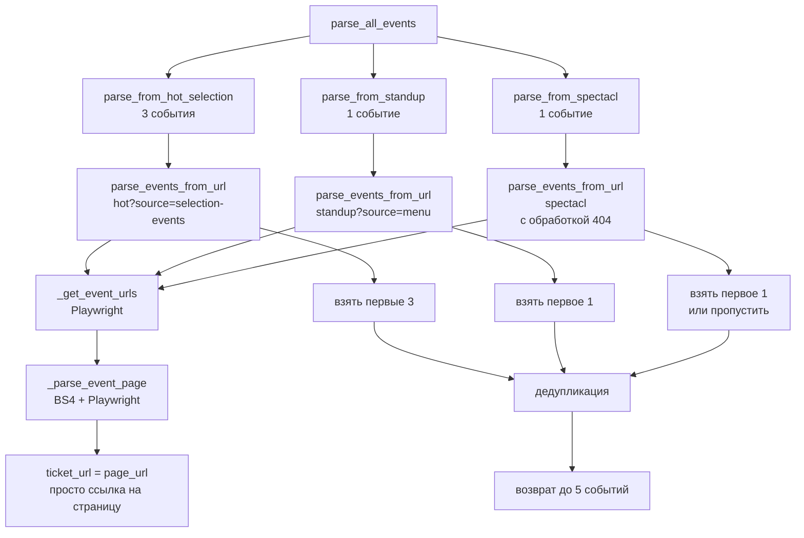

# План редизайна парсера Яндекс Афиши

## Контекст

Проект — Telegram-бот для парсинга мероприятий с Яндекс Афиши (Калининград), генерации постов через AI и публикации в канал. Текущий парсер собирает события с одного URL (из `.env`), пытается найти внешние ссылки на билеты (kassir.ru, ticketland.ru и т.д.).

## Целевая архитектура



## Файлы, подлежащие изменению

| # | Файл | Тип изменений |
|---|------|--------------|
| 1 | `parsers/yandex_afisha.py` | Основная переработка |
| 2 | `handlers/admin.py` | Точечные правки (сигнатура вызова) |
| 3 | `config.py` | Опционально — убрать `yandex_afisha_url` |

## Детальный план по шагам

### Шаг 1. `parsers/yandex_afisha.py` — проверка HTTP-статуса

**Проблема:** `_get_event_urls()` вызывает `page.goto()` без проверки статуса. Если страница возвращает 404/500, Playwright молча загружает тело, и парсер продолжает работать с мусором.

**Решение:** добавить в `_get_event_urls()` проверку `response.status`:

```python
response = await page.goto(base_url, wait_until="domcontentloaded", timeout=45000)
if response and response.status >= 400:
    logger.warning(f"HTTP {response.status} for {base_url}, skipping")
    return []
```

Аналогичную проверку добавить в `_parse_event_page()`.

---

### Шаг 2. `parsers/yandex_afisha.py` — переименовать `parse_events()` в `parse_events_from_url()`

**Текущая сигнатура:**
```python
async def parse_events(afisha_url: str, max_events: int = 3) -> list[EventData]
```

**Новая сигнатура (без изменений логики):**
```python
async def parse_events_from_url(afisha_url: str, max_events: int = 5) -> list[EventData]
```

Внутренняя логика **не меняется**, только имя. Это позволяет переиспользовать функцию для каждого источника.

---

### Шаг 3. `parsers/yandex_afisha.py` — упростить `_extract_ticket_url()`

**Текущее поведение:** функция проходит по 4 стратегиям поиска внешних ссылок на билетные сервисы, fallback — `page_url`.

**Новое поведение:** функция **всегда** возвращает `page_url`:

```python
async def _extract_ticket_url(soup: BeautifulSoup, page_url: str) -> str:
    """All ticket links are now just the afisha page itself."""
    return page_url
```

Это не ломает `EventData`, поле `ticket_url` по-прежнему заполняется. В БД поле `ticket_url` также заполняется (дублирует `afisha_url`).

**Влияние на UI публикации** (`handlers/publish.py`):
- В `send_events_list()` условие `ticket != afisha` всегда будет `False` → всегда показывается ветка «страница афиши»
- В `on_confirm()` условие `ticket_url != afisha_url` всегда `False` → админу показывается `afisha_url` как подсказка
- Админ сам вводит реферальную ссылку в `on_ref_url()` — **это не меняется**

---

### Шаг 4. `parsers/yandex_afisha.py` — создать оркестратор `parse_all_events()`

**Сигнатура:**
```python
async def parse_all_events(max_total: int = 5) -> list[EventData]
```

**Источники (хардкод):**

| Источник | URL | Лимит |
|----------|-----|-------|
| hot | `https://afisha.yandex.ru/kaliningrad/selections/hot?source=selection-events&city=kaliningrad` | 3 |
| standup | `https://afisha.yandex.ru/kaliningrad/standup?source=menu` | 1 |
| spectacl | `https://afisha.yandex.ru/kaliningrad/selections/spectacl` | 1 |

**Логика:**
1. Собрать события со всех трёх источников **параллельно** (`asyncio.gather`)
2. Дедупликация по `afisha_url`
3. Общий лимит: горячее — до 3, стендап — до 1, спектакли — до 1
4. Если источник вернул 0 событий — пропускаем

---

### Шаг 5. `parsers/yandex_afisha.py` — обработка 404 для spectacl

Внутри `parse_events_from_url()` (шаг 2) уже будет проверка HTTP-статуса. Для источника `spectacl` при 404 функция вернёт `[]`, оркестратор продолжит работу.

Дополнительно можно обернуть вызов в try/except в оркестраторе на случай сетевых ошибок.

---

### Шаг 6. `handlers/admin.py` — обновить `run_check()`

**Текущий код:**
```python
raw_events = await parse_events(config.yandex_afisha_url, max_events=count)
```

**Новый код:**
```python
from parsers.yandex_afisha import parse_all_events
raw_events = await parse_all_events(max_total=count)
```

Параметр `config.yandex_afisha_url` больше не используется в `run_check()`.

---

### Шаг 7. `config.py` — удалить `yandex_afisha_url`

**Вариант A (рекомендуемый):** удалить поле `yandex_afisha_url` из `Config` и из `.env`, поскольку URL теперь хардкодятся в парсере.

**Вариант B:** оставить для обратной совместимости, но не использовать. Просто закомментировать в `.env`.

Выбран **вариант A** — удалить, так как это убирает мёртвый код.

---

### Шаг 8. Валидация

После внесения изменений проверить:

1. ✅ `parse_all_events()` возвращает от 0 до 5 событий
2. ✅ При недоступности spectacl (404) — бот продолжает работу
3. ✅ При недоступности standup — аналогично
4. ✅ `ticket_url == afisha_url` для всех событий
5. ✅ `event_exists()` работает корректно (сравнивает по `afisha_url`)
6. ✅ Админ получает список событий и может публиковать
7. ✅ Кнопка «Купить билет» заполняется реферальной ссылкой от админа

## Не меняется

| Компонент | Причина |
|-----------|---------|
| `database/db.py` | Схема БД не меняется, поля `ticket_url` и `afisha_url` остаются |
| `handlers/publish.py` | Логика UI не требует изменений (всегда `ticket == afisha`) |
| `services/publisher.py` | Кнопка публикации не зависит от источника ссылки |
| `services/settings.py` | `parse_count` работает как раньше |
| `services/scheduler.py` | Без изменений |
| `ai/text_generator.py` | Без изменений |

## Примечания по селекторам

Текущие селекторы в `_get_event_urls()` ищут ссылки вида `/kaliningrad/{concert,theatre,...}/slug`. Это универсальный паттерн Яндекс Афиши — он должен работать для всех трёх источников. Если структура HTML на страницах-источниках изменилась, селекторы могут потребовать уточнения, но это маловероятно.
